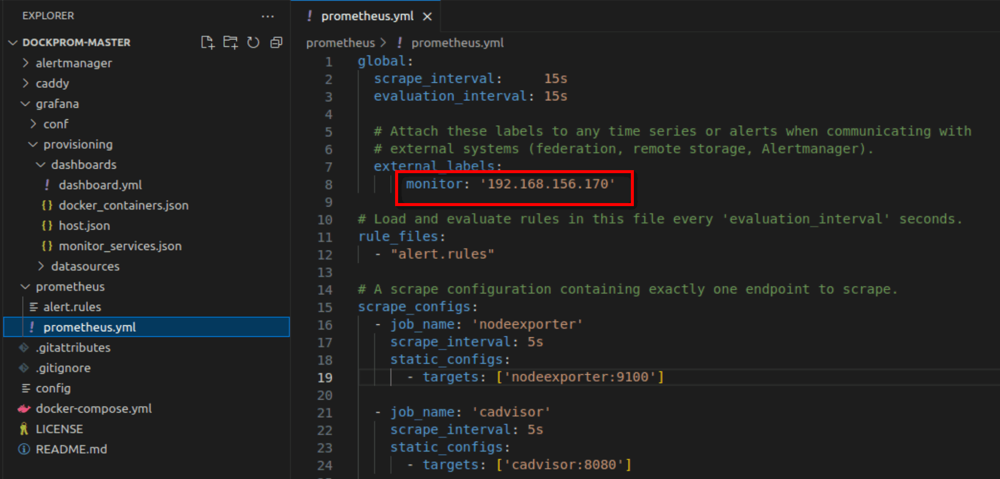

# SETUP PROMETHEUS, GRAFANA, GỬI CẢNH BÁO ALERTMANAGER QUA SLACK, TELE.


## I. SET UP DỰ ÁN. 

tham khảo:
```
             - SERVER MONITOR: https://github.com/DoQuan2001/dockprom

             - SERVER CẦN MONITOR: https://github.com/DoQuan2001/dockprom-exporter

```
KHI build server nào nhớ đổi chỗ này thành IP của server đó





## II. TẠO DASHBOARD CHO GRAFANA.


[2.1. TẠO DASHBOARD](./docx/4_tạo_dashboard_grafana.md)


## III. GỬI CẢNH BÁO ALERTMANAGER.

[3.1. VIẾT RULE](./docx/1_RULE.md)

[3.2. GỬI CẢNH BÁO QUA SLACK](./docx/2_gửi_cảnh_báo-slack.md)

[3.3. GỬI CẢNH BÁO QUA TELEGRAM](./docx/3_gửi_cảnh_báo_tele.md)


