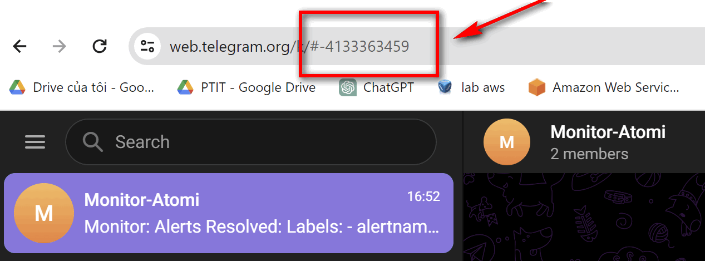

# GỬI CẢNH BÁO QUA TELEGRAM

## BƯỚC 1; TẠO TELEID_TOKEN.


TRUY CẬP TELEGRAM, tìm kiếm botfather


#### SAU đó /start ->/newbot

#### NÓ HỎI GÌ, TRẢ LỜI ĐẤY, TIẾP THEO ĐIỀN TÊN VÀ USERNAME CỦA BOT. CHO TỚI KHI NÓ XUẤT HIỆN TOKEN.


## BƯỚC 2: TẠO 1 GROUP TELE ĐỂ SAU NÀY TIỆN CHO MỌI NGƯỜI VÀO XEM CẢNH BẢO.

ta sẽ tạo 1 group telegram rồi add menber là con bot vừa rồi vào. cũng như muốn add ai xem cảnh báo thì add nha.

## BƯỚC 3: LẤY ID CỦA GROUP.
ID của group là cái này nè.




## BƯỚC 4: CHỈNH SỬA FILE CẤU HÌNH CỦA ALERTMANAGER.

ta sẽ chỉnh sửa file config.yaml của alertmanager.

```
route:
  group_by: ['alertname']
  group_wait: 10s     
  receiver: 'telegram_receiver'

receivers:
- name: 'telegram_receiver'
  telegram_configs:
  - api_url: 'https://api.telegram.org'
    bot_token: 'token vừa nãy ở bước 1'
    chat_id: cái id của group ở bước 3

```


CẢNH BÁO NHƯ SAU:


---
*DANH MỤC THAM KHẢO*

[1] https://www.itblognote.com/2021/07/create-alert-grafana-send-to-telegram.html