# TẠO DASHBOARD GRAFANA

## I. TẠO DASHBOARD.

VÀO PHẦN DASHBOARD

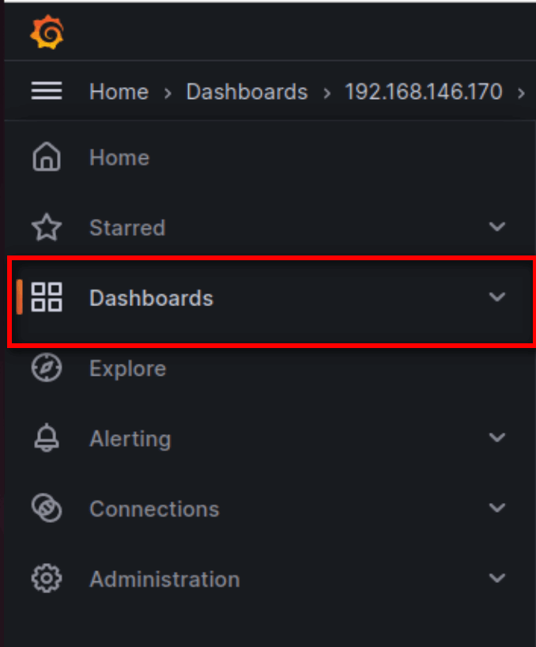

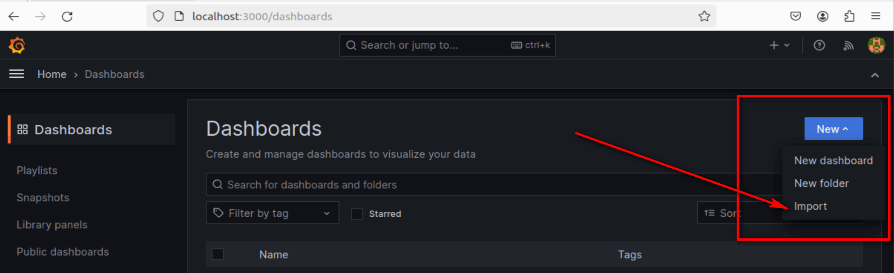

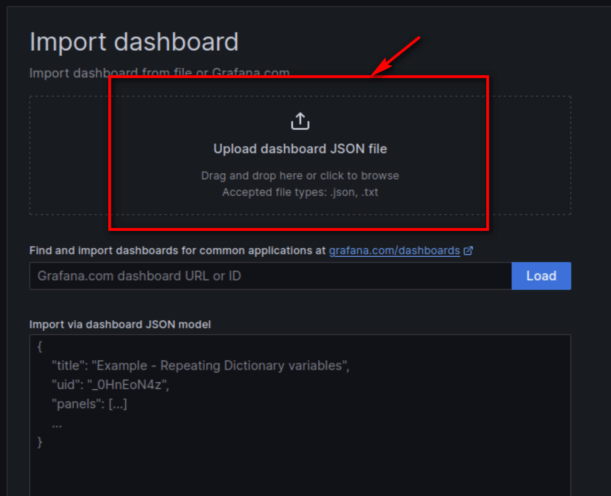

SAU ĐÓ TA CHỌN 1 FILE JSON DASHBOARD TRONG THƯ MỤC GRAFANA Ở SOURCE CODE PROJECT CỦA TA.

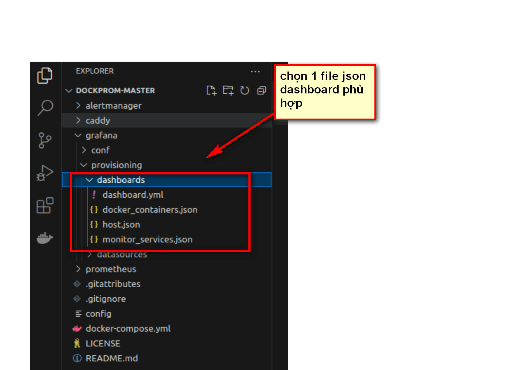

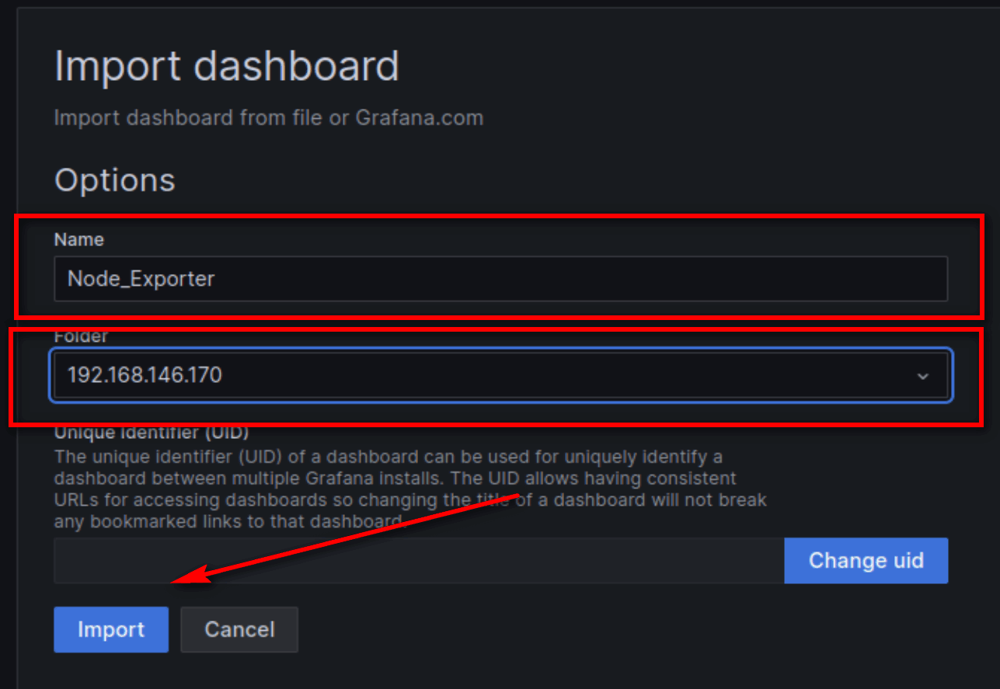

## II. TẠO DATA SOURCE CHO DASHBOARD.

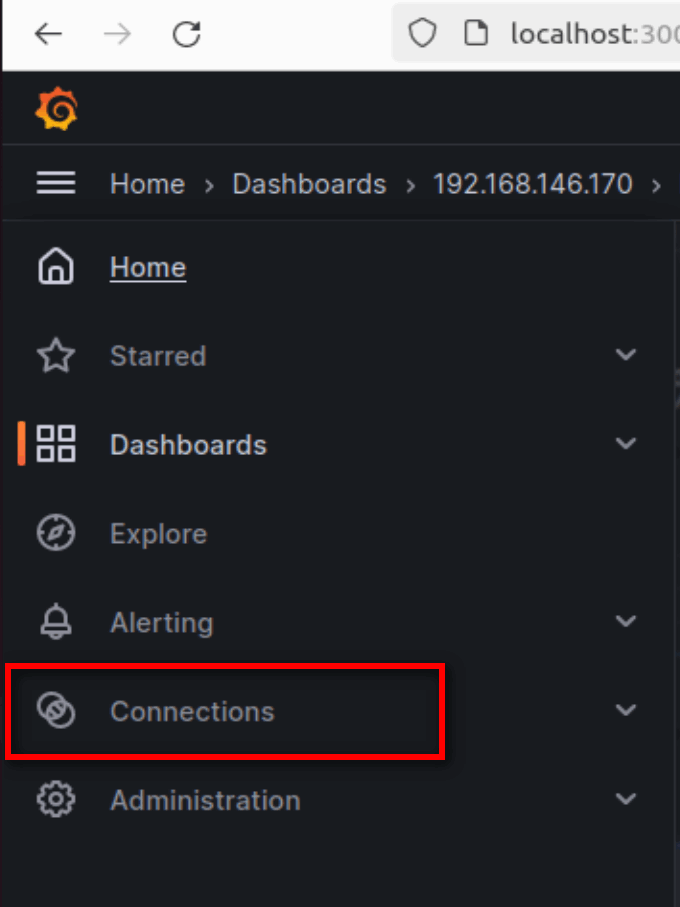

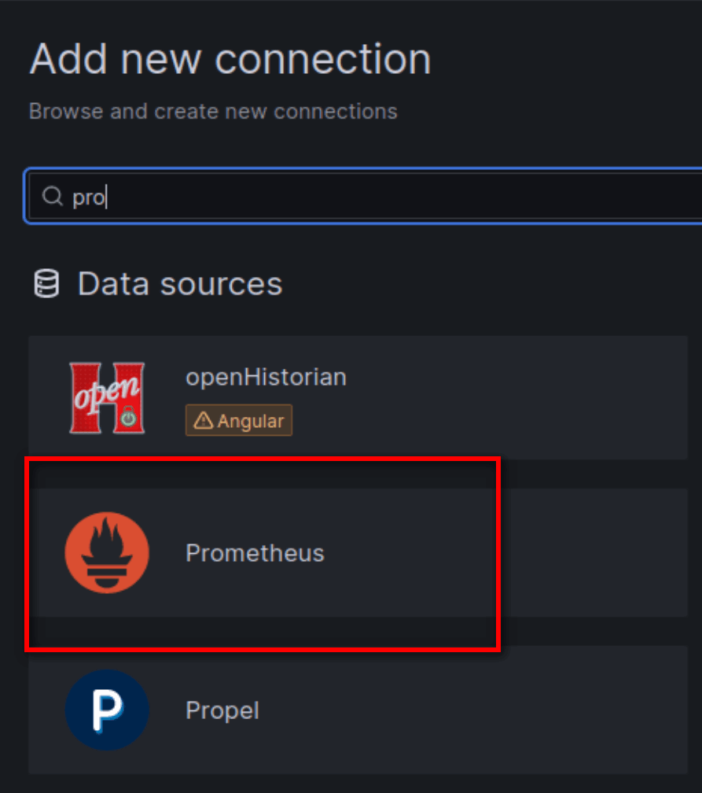

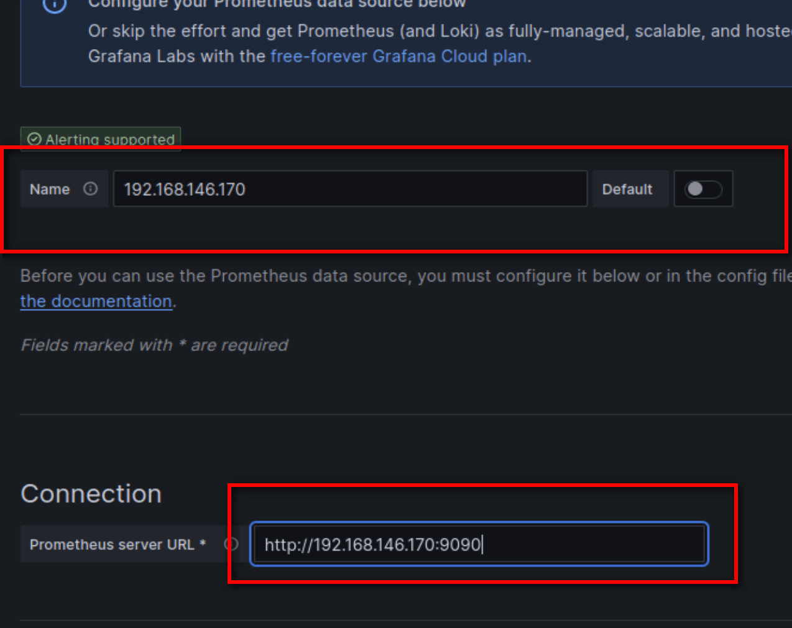

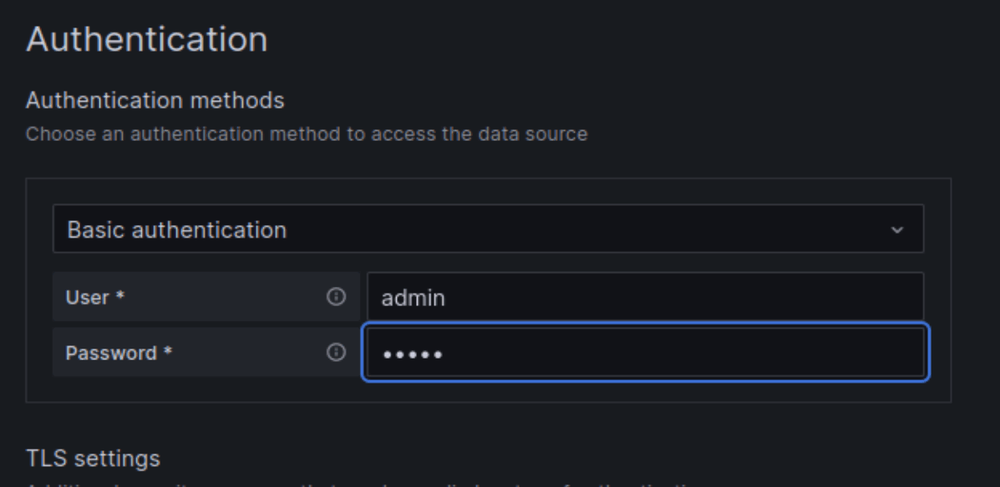

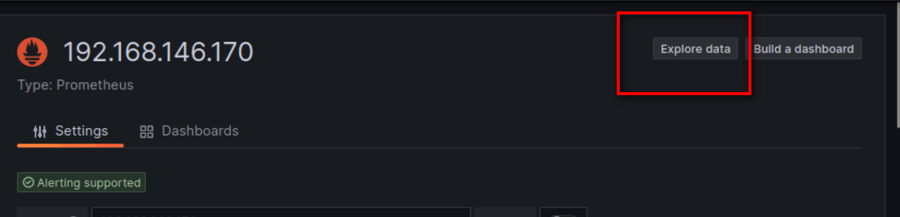

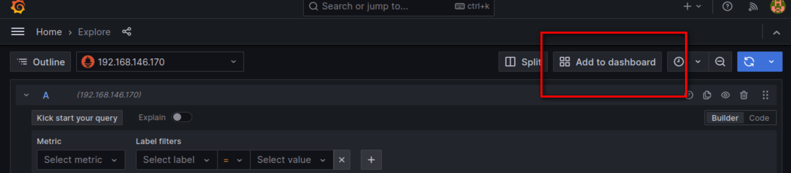

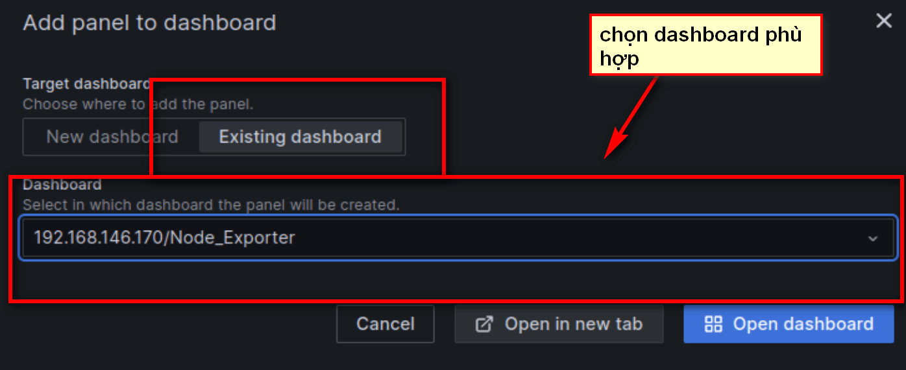

