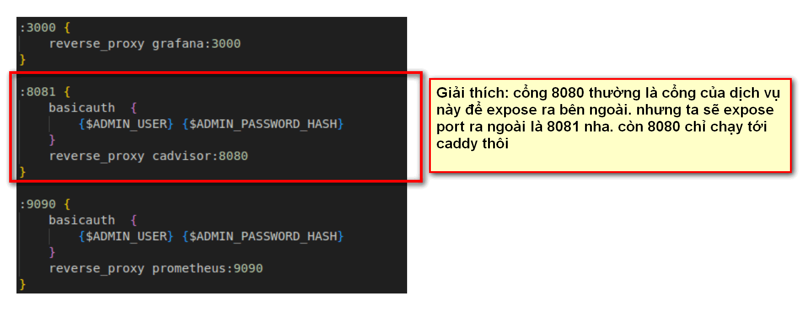

# ĐỔI PORT CADDY.

## I. GIỚI THIỆU VỀ CADDY.

## II. CẤU HÌNH PORT.

### 2.1 TẠO PASS_HASH(THẬT RA K CẦN CÁI NÀY VẪN OKE NHA)

`docker run --rm caddy caddy hash-password --plaintext 'ADMIN_PASSWORD`: tạo ra hàm băm.

TIẾP THEO CẦN CẬP NHẬT HÀM BĂM VÀO CÁI FILE DOCKER-COMPOSE CHỖ BIẾN ENV NHA. HOẶC SAU KHI LẤY ĐƯỢC PASSWORD_HASH TA CHẠY LỆNH TIẾP:

`ADMIN_USER='admin' ADMIN_PASSWORD='admin' ADMIN_PASSWORD_HASH='PASS_HASH VỪA LẤY Ở BƯỚC VỪA RỒI' docker-compose up -d`

CHỈ CẦN CHẠY BƯỚC NÀY LẦN ĐẦU TIÊN CHẠY THÔI NHÉ. NHỮNG LẦN SAU CHỈ CẦN UP LÊN THÔI.

### 2.2.  CẤU HÌNH PORT.

vào file CaddyFile. ta sẽ cấu hình như sau:

VÍ DỤ MUỐN CADVISOR TRUY CẬP LOCALHOST 8085 THÌ ĐỔI CHỖ 8081 KIA THÀNH 8085 NHA.

SAU ĐÓ TRUY CÂỌ VÀO FILE DOCKER-COMPOSE ĐỔI PORT THÀNH 8085 NHA.

VÀ  NHỚ CHẠY LẠI NHÉ.

