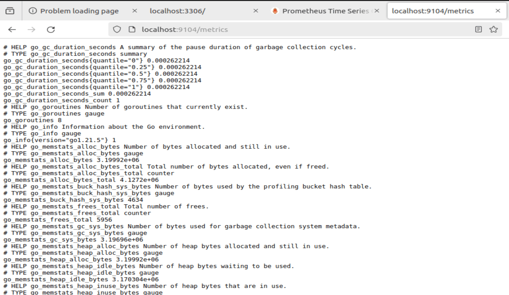
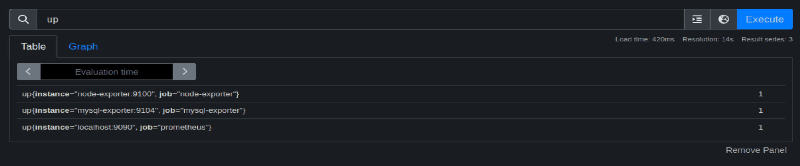

# MONITORING DATABASE.


## I. MONITORING MYSQL


SOURCE CODE: 

###  BƯỚC 1: PHẢI CÓ 1 CONTAINER MYSQL.


```

version: '3.8'

services:
  mysql:
    image: mysql
    restart: always
    container_name: mysql
    networks:
      - monitoring-network
    environment:
      MYSQL_ROOT_PASSWORD: root
      MYSQL_DATABASE: my_database
      MYSQL_USER: admin
      MYSQL_PASSWORD: admin
  
    ports:
      - "3306:3306"

networks:
  monitoring-network:
    driver: bridge


```
SAU ĐÓ NHỚ CHẠY NÓ LÊN.


### BƯỚC 2: CHẠY CONTAINER MYSQL_NODE EXPORTER.


```

mysql-exporter:
    image: "prom/mysqld-exporter"
    container_name: mysql_exporter
    networks:
    - monitoring-network
    ports:
    - "9104:9104"
    environment:
    - DATA_SOURCE_NAME=admin:admin@(mysql:3306)/ #(cái đoạn này mysql là tên container mysql ở bước 1), admin/admin là  cái user mình đặt trong biến đó.
    volumes:
      - ./mysql/.my.cnf:/.my.cnf

networks:
  monitoring-network:
    driver: bridge


```


CHƯA CHẠY ĐƯỢC, THẤY VOLUME NÓ CÓ FILE .MY.CNF CHƯA, PHẢI TẠO NÓ NHA.


```

[client]
host = localhost
user = admin
password = admin
database = my_database


```

SAU ĐÓ NHỚ CHẠY NÓ LÊN.


### BƯỚC 3: CHỈNH SỬA FILE PROMETHEUS.YAML

THÊM 1 JOB  VÀO.

```

- job_name: mysql-exporter
  static_configs:
  - targets:
    - mysql-exporter:9104

```

### BƯỚC 4: CHẠY NÓ NHA.


KIỂM TRA XEM NÓ LẤY METRIC VỀ CHƯA






### BƯỚC K LIÊN QUAN LẮM, (NHÁP ĐỂ Ở ĐÂY) : TẠO 1 NGƯƠÒ DÙNG

`docker exec -it container_ID mysql -u<username> -p<pass>`: truy cập vào sql plus.


`SELECT user FROM mysql.user;` lệnh list ra tên username của database


---

*Tham khảo*

[1] hướng dẫn fix lỗi: https://blog.csdn.net/Camel_LT/article/details/132608702


[2] hướng dẫn cài đặt: https://severalnines.com/blog/how-monitor-mysql-containers-prometheus-deployment-standalone-and-swarm-part-one/